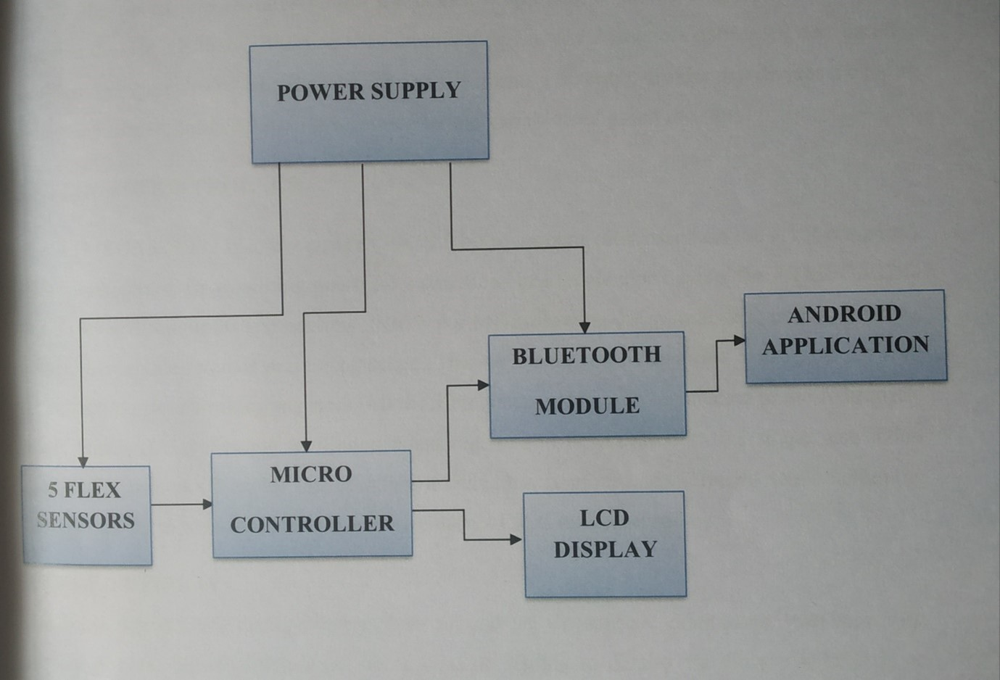
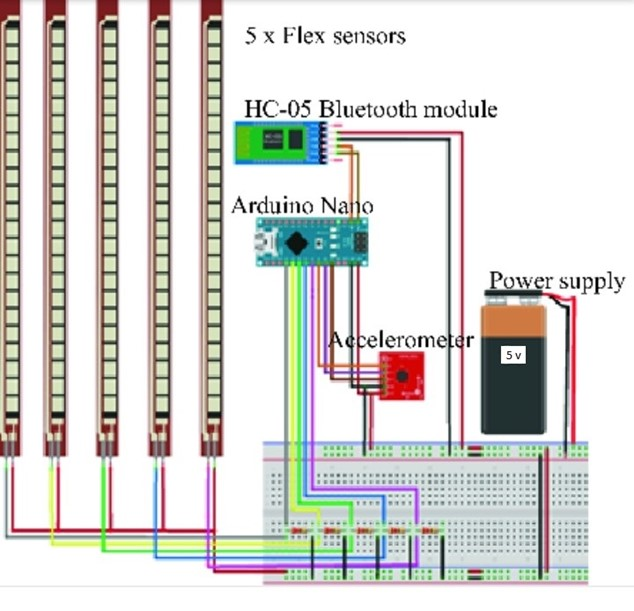

 

  <h1 align="center">SMART GLOVE FOR SIGN LANGUAGE CONVERSION</h1>
  <h2 align="center">Mini Project</h2>

 

<h4 align="center"> SUBMITTED BY:</h4>
<h3 align="center"> BASIL REJI, 
ANJALI RATHESH,  
APARNA S, 
ANANTHU KRISHNA S, 
ADERSH </h3>  

IN PARTIAL FULFILLMENT OF REQUIREMENT FOR THE AWARD OF DEGREE OF  
BACHELOR OF TECHNOLOGY  
IN  
ELECTRICAL AND ELECTRONICS ENGINEERING  
DIVISION OF ELECTRICAL ENGINEERING  

 
    
  SCHOOL OF ENGINEERING  
COCHIN UNIVERSITY OF SCIENCE AND TECHNOLOGY   COCHIN-682022 

<h2 align="center"> CERTIFICATE </h2>

 
Certified that the report entitle <b>SMART GLOVE FOR SIGN LANGUAGE CONVERSION</b>
is a bonafide record of work done by
BASIL REJI (19180019),
ANJALI RATHESH (19180010),
APARNA S (19180012),
ANANTHU KRISHNA S (19180009) and 
ADERSH (19170003)
towards the partial fulfilment for the award of the degree of B. Tech in Electrical & Electronics Engineering of Cochin University of Science and Technology, Kochi-682022. 

<table border="0">
 <tr>
    <td><b style="font-size:30px">Dr. Asha E Daniel</b></td>
    <td><b style="font-size:30px">Ms. Jeena John</b></td>
    <td><b style="font-size:30px">Ms. Ragi R Menon</b></td>
 </tr>
 <tr>
    <td>Head of Department    Division of Electrical
Engineering,   SOE,CUSAT</td>
    <td>Assistant Professor   Division of Electrical Engineering,   SOE, CUSAT</td>
    <td>Assistant Professor   Division of Electrical Engineering,   SOE, CUSAT</td>
 </tr>
</table>

<h2 align="center"> ABSTRACT </h2>

 
This report is on the implementation of “SMART GLOVE FOR SIGN LANGUAGE CONVERSION”. Roughly 27.8% of the total population of India can’t either hear or speak. Sign language is a non-verbal form of communication method which is found among all deaf and dumb communities. Normal people do not learn sign language, it causes barriers in communication between deaf and dumb people. Hence to break this barrier we design a system which converts hand gestures into auditory speech as well as text. The system is being proposed with use of flex sensors and android technology. There are 2 modules, first is a glove with flex sensors and Atmel ATMEGA328 PU microcontroller and second is an android app with Google speech API. 

<h2 align="center"> INTRODUCTION </h2>

 
About eighteen million people in the planet are dumb or deaf. The communication between a dumb and hearing person becomes difficult because sign languages are unknown to normal people. Also, even the communication among deaf people are a bit hard due the disparities of sign languages from nation to nation. This creates an extremely little house for them, with communication being an associate degree for elementary aspect of human life. The languages haven't got a typical origin and hence are hard to interpret. A dumb communication interpreter is also a tool that interprets the hand gestures to sensible speech.
The primary aim of this paper is to introduce an issue that will efficiently translate hand gestures into its equivalent textual and voice representation. The interpreter makes use of a glove totally based on the technique comprising of flex sensors. For each hand gesture created by the right hand, 5 sets of voltage combinations are formed by the sensors for further processing in the microcontroller. Then the controller matches the gesture with pre-stored inputs. The output is brought with the help of an android smartphone using an android app.

 
   

  
<h2 align="center"> BLOCK DIAGRAM DESCRIPTION</h2>

 
  
<h4>POWER SUPPLY</h4>
The power supply is designed to convert high DC voltage to low DC voltage for the electronic devices used in the circuit. The main power source of the circuit is 12V battery. But the most of the devices used in the circuit work on 5V DC supply. So we use 7805 Voltage regulator to covert 12V DC supply to 5V DC supply which in turn powers the Flex sensors and Microcontroller. The Bluetooth module and LCD Display are powered by microcontroller

<h4>FLEX SENSORS</h4>
Flex sensors are resistive carbon parts. When bent, the device develops a resistance output correlative to the bend radius. The variation in resistance is just about 10kΩ to 30kΩ. A global organization flexed device has 10kΩ resistance and once bent the resistance will increase to 30kΩ at 90o. The device incorporates within the device employing a potential divider network. The potential divider is employed to line the output voltage across 2 resistors connected non-parallel as shown in Figure 2. The electrical device and flex forms a potential divider that divides the input voltage by a quantitative relation determined by the variable and glued resistors.

<h4>MICROCONTROLLER</h4>
The ATMEGA328-PU is a low power CMOS 8 bit microcontroller based on the AVR enhanced RISC architecture. By executing powerful instructions in a single clock cycle, the ATMEGA328-PU achieves throughputs approaching 1MIPS per MHz allowing the system designed to optimize power consumption versus processing speed. The AVR core combines a rich instruction set with 32 general purpose working registers. All the 32 registers are directly connected to the Arithmetic Logic Unit (ALU), allowing two independent registers to be accessed in one single instruction executed in one clock cycle. The resulting architecture is more code efficient while achieving throughputs up to ten times faster than conventional CISC microcontrollers.

<h4>LCD DISPLAY</h4>
We come across LCD displays everywhere around us. Computers, calculators, television sets, mobile phones, digital watches use some kind of display to display the time. An LCD is an electronic display module which uses liquid crystal to produce a visible image. The 16×2 LCD display is a very basic module commonly used in DIYs and circuits. The 16×2 translates a display 16 characters per line in 2 such lines. In this LCD each character is displayed in a 5×7-pixel matrix.

<h4>BLUETOOTH MODULE</h4>
It is used for many applications like wireless headset, game controllers, wireless mouse, wireless keyboard and many more consumer applications. It has range up to <100m which depends upon transmitter and receiver, atmosphere, geographic & urban conditions. HC-05 is a Bluetooth module which is designed for wireless communication. This module can be used
Smart Glove for Sign Language Conversion
School of Engineering, CUSAT 6 Mini Project
in a master or slave configuration. HC-05 is a Bluetooth module which is designed for wireless communication. This module can be used in a master or slave configuration.
  
<h4>ANDROID APPLICATION</h4>
In this project we are using an Android application for text to speech conversion. The microcontroller interprets the hand gesture and generate respective messages. These messages are send to the Android app through Bluetooth. The app converts these text messages to the respective audio messages which are transmitted by the phone’s speakers.

<h2 align="center"> CIRCUIT DIAGRAM </h2>

 
   

 
<h2 align="center"> WORKING </h2>

 
Disabled use these gloves to convert sign performed by them into speech. From the
convenience of simple flex sensors, a user is able to interact with others in more comfortable
and easier manner. This makes it possible for the user to not only interact with their
community but with others also and they can also live normal life. The end product will have
a cheap and simplistic design making it easy for users to interact with. The system is capable
of recognizing signs more quickly. Furthermore, real time recognition ratio of nearly 99%
can be easily achieved.
The averaging we do at each interval helps to account for any noise or glitches that the flex
sensors are sometimes prone to. The accuracy of the glove is also somewhat limited by the
size of the person’s hands. The accuracy of each flex sensor is limited beyond a certain point.
Smaller hands will result in a larger degree of bend. As a result, the difference between
slightly different signs with a lot of flex might be too small for users with small hands. The
device uses a low voltage environment, and extremely low frequency communication. The
sensors are well attached, and there are no sharp edges. As a result, we don’t see any large
safety issues associated with the glove. Furthermore, since all communication is done via
cables, our device does not interfere with other designs. The glove can be used by anyone
who fits into it, they would only have to train on it and generate new datasets if they wish for a higher prediction accuracy than the standard or to incorporate new signs.

<h2 align="center"> CONCLUSION AND FUTURE SCOPE </h2>
 
 
Sign language is a method used for communication by disabled person. Here we are converting sign language into text and speech so that communication is not limited between them only, utilizing data gloves communication barrier between two different communities is eliminated. Using smart gloves disabled person can also grow in their carrier and makes nation grow as percentage of disabled person are millions in count. Making their future better and hence making nation better.
This report gives a brief about the project that is useful for speech or hear impaired patients. This work was able to meet our expectations quite well. This project was meant to be a finished device to check the feasibility of recognizing sign languages using sensor gloves. The completion of this project suggests that sensor gloves can be used for partial sign language recognition. 

<h2 align="center"> REFERENCES </h2>
 
 
1) K Abhijit Baskaran; Anoop G. Nair; K Deepak Ram; Krishnan Ananthanarayanan; H. R. Nandi Vardhan “Smart gloves for hand gesture recognition: Sign language to speech conversion system”, 2016 International Conference on Robotics and Automation for Humanitarian Applications (RAHA), IEEE Xplore, May 2017
2) Albert Mayan J, Dr. B. Bharathi, Challapalli Vishal, Chidipothu Vishnu Vardhan Subrahmanyam “Smart Glove For Hand Gesture Recognition Using Sign Language to Speech Conversion System”, International Journal of Pure and Applied Mathematics, Volume 119, pp. 12, 2018.
3) Shahrukh Javed1, Ghousia Banu S1, J Aarthy Suganthi Kani1 and Ateequeur Rahman2 “Wireless Glove for Hand Gesture Acknowledgment: Sign Language to Discourse Change Framework in Territorial Dialect”, Robotics and Automation Engineering Journal, June 26, 2018
4) Gupta, Dhiraj- “Design and development of a low-cost Electronic Hand Glove for deaf and blind”, 2nd International Conference on Computing for Sustainable Global Development (INDIA.Com), pp 501-505, 11-13 March 2015.
5) https://ieeexplore.ieee.org/
6) https://www.researchgate.net/
7) https://www.semanticscholar.org/
8) https://electronicsforu.com/
9) https://www.instructables.com/
10) https://en.wikipedia.org/ 

